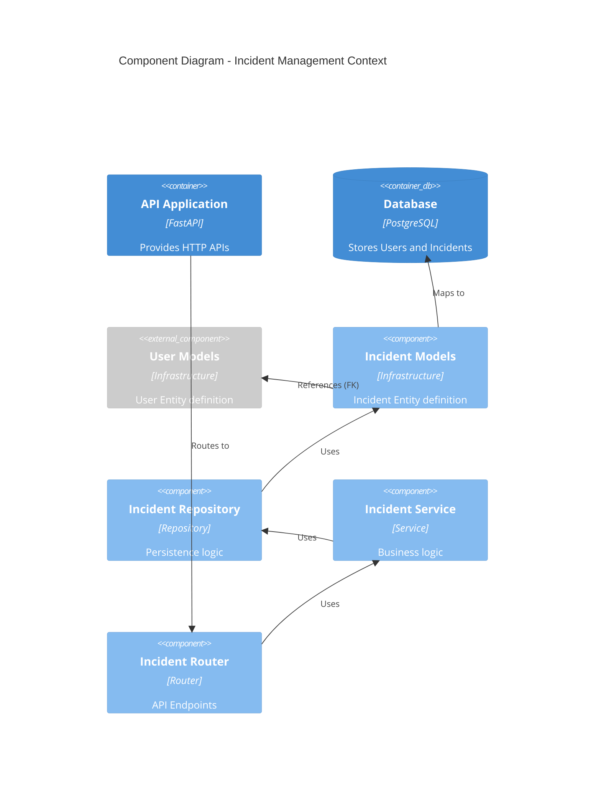

# Architectural Model

## Component Diagram (Backend)

```mermaid
C4Component
    title Component Diagram - Incident Management Context

    Container(api, "API Application", "FastAPI", "Provides HTTP APIs")
    ContainerDb(db, "Database", "PostgreSQL", "Stores Users and Incidents")

    Component_Ext(user_models, "User Models", "Infrastructure", "User Entity definition")
    
    Component(incident_models, "Incident Models", "Infrastructure", "Incident Entity definition")
    Component(incident_repo, "Incident Repository", "Repository", "Persistence logic")
    Component(incident_service, "Incident Service", "Service", "Business logic")
    Component(incident_router, "Incident Router", "Router", "API Endpoints")

    Rel(api, incident_router, "Routes to")
    Rel(incident_router, incident_service, "Uses")
    Rel(incident_service, incident_repo, "Uses")
    Rel(incident_repo, incident_models, "Uses")
    Rel(incident_models, db, "Maps to")
    
    Rel(incident_models, user_models, "References (FK)")
```
